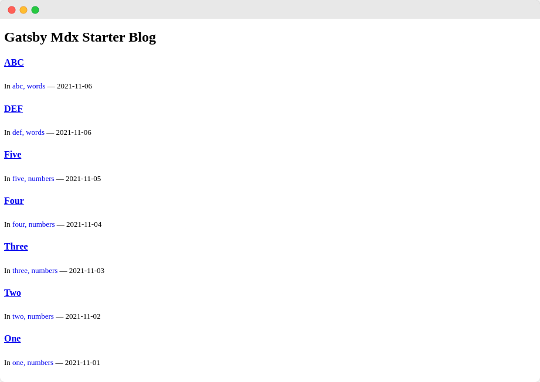
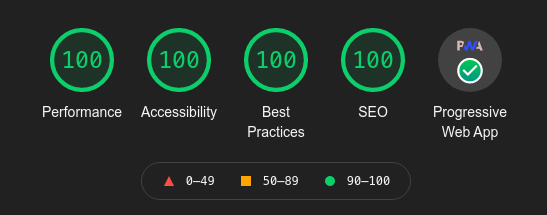

## 🍰 Gatsby MDX Starter Blog


Gatsby Starter Blog with Mdx support

  



###  [🚀 Launch Demo](https://gatsby-mdx-starter.netlify.app/)

### 🍨 Features:

- [x] Gatsby
- [x] No Style, No CSS Frameworks included
- [x] Uses Mdx for blog post
- [x] Category pages
- [x] SEO Friendly URLs for blog post
- [x] PWA
- [x] Offline Support
- [x] Built-in Sitemap
- [x] Custom 404 page
- [x] Basic SEO Implementation with React Helmet
- [x] 7 Sample post in two different categories

### 🌀 Lighthouse Score



### 🗂️ Development

- Clone this Repository

```
git clone https://github.com/mcnaveen/gatsby-mdx-starter-blog
```

- cd into directory
```
cd gatsby-mdx-starter-blog
```
- Install the Dependencies
```
yarn install
```
- Then start Gatsby development server
```
gatsby develop
```
### 🀄 Production
- You have to build the project using the below command
```
gatsby build
```
- Then upload the Public directory to your server

### 🍥 Todo

- [ ] Included React Helmet, But not fully configured yet for SEO

### 🛡️ License
- MIT
